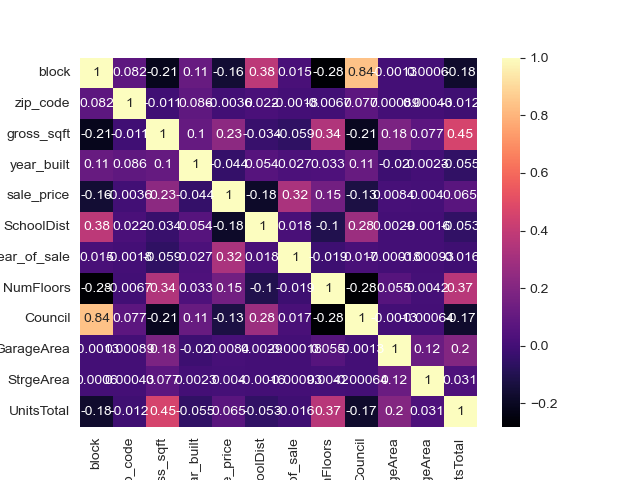

# Brooklyn Housing Analysis

Housing markets in the contemporary era provide a vast, diverse, and highly relatable set of data for beginners to work with. By looking at housing prices within Brooklyn, New York, we can adequately assess the housing market using a variety of tools. Brooklyn is the second most expensive borough, after Manhattan, and it also has a high residential turnaround. Creating a model based on the housing market in Brooklyn could be an invaluable tool. It may also prove useful to apply what we learn to assess other housing markets in the US, especially to home buyers who are looking to live in fast growing, highly populated, urban areas.

## Data

Data used in analysis was Brooklyn property sales from 2003-2017 sourced from kaggle.com by Tommy Wu. Original data was taken from the City of New York and cleaned up to be used for analysis.

## Research Questions

-   Can we predict future home prices in Brooklyn based on the year that the home was bought?
-   Does square footage of Brooklyn homes drastically effect the price of the home?
-   How do the neighborhoods compare in pricing within Brooklyn?
-   How have prices fluctuated within a specific range of years?
-   Are there any other factors that contribute to changes in housing prices?

## Technologies Used

### Google Slides Presentation
[Brooklyn Housing Analysis](https://docs.google.com/presentation/d/1S5SWDg1g-fo5eKKniRpoEzsBGJHBH_mhhbNbJsAG0nc/edit?usp=sharing).

### Data Cleaning and Analysis

Pandas will be used to clean the data and perform an exploratory analysis. Further analysis will be completed using Python and Plotly.

#### Data Cleaning: Excel / Pandas / Python
We used the pandas library to clean the data. First, we dropped any columns that were irrelevant or couldn't be interpreted. Next, we removed any rows with null values to ensure that the data was complete and accurate. After that, we built a helper script specifically to target the 'sale_price' column and identify and remove any outliers. 

This helped to ensure that the data in the 'sale_price' column was accurate and consistent, which is important for any further analysis or modeling that will be done. Finally, we made sure that all columns were of the correct data type, turning objects into integers. This ensures that we can use the data correctly in any further analysis or modeling.

#### Data Analysis

### Database Storage

Postgres(SQL) is the database we intend to use.

### Machine Learning Model

SciKitLearn is the machine learning library we'll be using to create a classifier.

We initially chose a Linear Regression model. The benefit of using a linear regression model is that it is easy to implement and computationally inexpensive. It can also be used to predict future values based on historical data. Linear regression can provide a good starting point for more complex models. However, it also makes strong assumptions about the data, such as linearity and equal variances of errors. If these assumptions are not met, the model may not be accurate. It also may not be able to capture complex relationships in the data. In addition, if you have a small data set or you have outliers in your data, a linear regression model can be affected and might not give accurate results.

In order to improve the efficacy of using a linear regression model, we chose five different methods:

* Ordinary Least Squares: used to predict a continuous target variable based on one or more input features.

* Ridge: similar to an OLS (Ordinary Least Squares) model, but it adds a penalty term to the cost function that is being optimized. The penalty term is a multiple of the sum of the squares of the coefficients, which helps to shrink the coefficients towards zero and reduce overfitting.

* Lasso: similar to Ridge regression, but it uses a different penalty term in the cost function. Instead of a sum of squares of the coefficients, Lasso uses the sum of the absolute values of the coefficients, which helps to shrink some of the coefficients all the way to zero, effectively selecting a subset of the input features for the model.

* Bayesian: The model parameters are treated as random variables and are assigned prior probability distributions. These prior distributions are then updated using the data to give the posterior probability distributions. The posterior distributions can then be used to make predictions about new data.

* Elastic Net: It is a combination of Ridge and Lasso regularization methods, which means it adds both L1 (absolute values of the coefficients) and L2 (squares of the coefficients) penalty terms to the cost function that is being optimized.

To cover our bases, we wanted to include other models to compare to the linear regression models. After researche, we decided to try a Random Forest and XGBoost models due to them being very common in housing analyses. Random Forest models consists of a collection of decision trees, where each tree is trained on a different random subset of the training data. In contrast, XGBoost is specifically designed for decision tree-based models and it uses a technique called gradient boosting to iteratively improve the model's accuracy by focusing on the misclassified examples in the training data.

Next, we decided to begin training our model with these features in order to predict the sale price, sale price being what we are testing on:

* block
* zip_code
* gross_sqft
* year_built
* sale_price
* SchoolDist
* year_of_sale
* NumFloors
* Council
* Garage Area

We chose these features due to feature importance, provided by XGBoosts library. We created a correlation matrix to better visualize the relationships, both are seen below:

*Feature Importances*

*Correlation Matrix of features*

After training the model on Sale Price in the data set, we achieved these results:

XGBoost seems to be the most accurate model to predict sales prices based on the recommended features. XGBoost has several key features that make it a popular choice among practitioners as well:

* It can handle missing values, categorical features and large datasets efficiently.
* It provides parallel computation on a single machine, as well as distributed computation on a cluster of machines.
* It has built-in regularization to avoid overfitting.
* It provides a feature importance score which can be used for feature selection.

XGBoost is widely used in many applications such as, Kaggle competitions, recommendation systems, and natural language processing. It is particularly popular in kaggle competitions because it is designed to be highly efficient and accurate, which makes it a top choice for building models with high predictive power.

### Dashboard

Tableau will be used to display a dashboard/story. Google Slides is being used as a placeholder for visualization.

[**Tableau Public Link**](https://public.tableau.com/views/BrooklynHomeAnalysis/BrooklynHomesDashboardFinal?:language=en-US&:display_count=n&:origin=viz_share_link)

#### Interactive elements
-Interactive maps generated from zip codes of Brooklyn with heat map overlayed based on building type.

-Interactive data table showing details of sales and ml learning results with capability of filtering the table based on zip code and neighborhood.

## Communication Practices
We will primarily be using Slack for communication. We will also be using Zoom for group coordination on certain tasks. We are all collaborating on various facets of the project; choosing a dataset, building a database, choosing a machine learning model, connecting the database to the model, as well as updating the GitHub and README have been completed together as a team.

